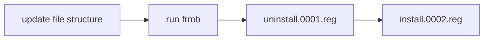

# Usage

You can also check the [demo video](img/demo.mp4).

## 1. creating the file structure

Start by creating a root directory anywhere on your system. You can decide
to create one "context-menu installer" for a lot of use-cases at once, or rather
multiple of them for each case, which would imply multiple root directories.

The choice is just about convenience, or you don't bother having multiple
`.reg` file to execute, or you want a single one for all your context-menus.

In that directory start by creating a first `.frmb` file arbitrary named (
ex: `action.frmb`).

As an example, here is a definitive structure of one of my use-cases:

```
root/
│   abcinfo.frmb
│   ffmpeg-to-gifs.frmb
│   ffmpeg.ico
│
├───.installers/
│       install.0001.reg
│       uninstall.0001.reg
│
├───abcinfo/
│       abcinfo-verbose.frmb
│       abcinfo.frmb
│
└───ffmpeg-to-gifs/
    │   ffmpeg-togif.bat
    │   video-to-gif-interactive.frmb
    │   video-to-gif-presets.frmb
    │
    └───video-to-gif-presets/
            togif-24fps-sd1-floyd.frmb
            togif-50fps-sd1-sierra24a.frmb
            ...
```

Which I use with the command :

```powershell
python -m frmb ./root --target-dir ./root/.installers 
```

The whole example can be found at https://github.com/MrLixm/lxm-frmb-projects.


### the `.frmb` file.

Each `.frmb` file represent an individual menu in the "global" context-menu.

!!! note

    `.frmb` files are just regular `.json` files with a different extension.

Its content specify how to configure the menu in the GUI.

**The name of the file matters** as it is used in the path of the registry key.
Fortunately Windows have no limitation on that side and allows for special 
characters.

!!! tip "Sorting Tip"

    This behaviour allow you to sort menus in the GUI. By default 
    Windows sort them alphabetically
    where `display.frmb` would be uppermore than `export.frmb`. If you wanted the
    inverse you could instead use `01export.frmb` and `02display.frmb`.

Content of the file is bound to the [json](https://en.wikipedia.org/wiki/JSON)
syntax and can be structured as follows :

```json
{
  "name": "",
  "icon": "",
  "paths": [""],
  "command": [""]
}
```

#### keys

_Other keys are allowed but not used._

=== "`name`"

    Used as label in the GUI. Any kind of string with any character.

=== "`icon`"

    A path to an absolute existing `.ico` file.

    Must use backslackes which are escaped `\\` in json.

    Supports:

    - path to a `.exe` file (their icon will be used by Windows)
    - environment variables like `%MY_VAR%`
    - :material-file-replace-outline: [tokens](usage.md#tokens)

=== "`paths`"

    List of Windows registry keys paths. The context-menu will be duplicated for
    each key path in the list.

    Must use backslackes which are escaped `\\` in json.
    
    Example to create a context-menu only on files with the `.abc` extension: 

    ```json
    paths = ["HKEY_CURRENT_USER\\Software\\Classes\\SystemFileAssociations\\.abc"]
    ```

=== "`command`"

    List of command line arguments executed when the menu is pressed.

    Support :material-file-replace-outline: [tokens](usage.md#tokens).

    Example to start a terminal and echo a message:

    ```json
    command = ["cmd", "/k", "echo", "hello world"]
    ```

    Be careful to [properly escape anything that should be](https://ss64.com/nt/syntax-esc.html).

    Example to start a `.bat` stored next to the `.frmb` file:

    ```json
    command = ["cmd", "/k", "\"@CWD\\\\scripts\\\\launcher.bat\""]
    ```

---

#### :material-file-replace-outline: tokens

Some keys can have their value including a token that is replaced when the file is read.

A token is added to a string using the syntax `@TOKEN_NAME`.

Example: `"@CWD\\file.ico"` could be resolved to `"D:\\os\\menus\\root\\file.ico"`

=== "`CWD`"

    The parent directory of the `frmb` file (with escaped backslashes).

=== "`ROOT`"

    The top-level directory of the context-menu hierarchy (with escaped backslashes).

If you need the `@` character to be interpreted literally, you can escape it
by doubling it. 

Example: `"@CWD\\file@@ROOT.ico"` could be resolved to `"D:\\os\\menus\\root\\file@ROOT.ico"`

#### "types"

You can distinguish 2 types of frmb file :

- :octicons-move-to-top-16: **`root files`** are located directly in the root directory.
  > they must always specify a `paths` key with at least one path.
- :material-file-tree-outline: **`nested files`** are at least one directory deep from the root directory.
  > they do **not** need the `paths` key.

Which can be further refined in 2 additional types :

- :material-folder-file-outline: **`directory files`** have the same file name as a next-to directory.
  > they do **not** need a `command` key.
- :fontawesome-solid-file-code: **`lowest level files`** which represent a menu that will execute a command
  > they need a `command` key else they are useless.

Example:

```shell
root/
│   maketx.frmb  # root / lowest level
│   ffmpeg-to-gifs.frmb  # root / directory
│
└───ffmpeg-to-gifs/
    │   ffmpeg-togif.bat
    │   video-to-gif-interactive.frmb  # nested / lowest level
    │   video-to-gif-presets.frmb  # nested / directory
    │
    └───video-to-gif-presets/
            togif-24fps-sd1-floyd.frmb  # nested / lowest level
            togif-50fps-sd1-sierra24a.frmb  # nested / lowest level
```

## 2. running frmb

`frmb` is mainly intended to be used as CLI but could also be used as a python
library for advanced use-cases.

### as a command line tool

Assuming python is installed and frmb is available in the `PYTHONPATH`:

```shell
python -m frmb --help
```

```python exec="on"
import os
import sys
root = os.environ["MKDOCS_CONFIG_DIR"]
if root not in sys.path:
  sys.path.append(root)
  
import frmb
msg = frmb.CLI(["--help"]).get_help_message()
print(f"```\n{msg}\n```")
```

with the file structure example shared in the first section :

```powershell
python -m frmb ./root --target-dir ./root/.installers 
```

the `.reg` files will then be found in `./root/.installers`

### as a python module

Check the [public-api](public-api.md) page for the documentation of available objects.

```python
from pathlib import Path
import frmb

root_dir = Path("D:/some/dir")
hierarchy = frmb.read_hierarchy_from_root(root_dir)
reg_content = frmb.generate_reg_from_hierarchy(hierarchy)

print("\n".join(reg_content))
```

!!! tip

    At any time you can add have a look the unittests in `tests/` for an
    actual example of the python API.

## 3. executing the reg files

!!! warning

    Registry manipulation can lead to data loss. It is recommended to back up
    you registry before editing it.

The script execution should produce 2 `.reg` files at the specified location.
One "install" the context-menu by adding reg keys while the other "uninstall"
by removing the reg keys.

All the reg files are versioned and incremented on each run, based on the last 
found version on disk. This is a safety to ensure you can fully uninstall
a previously installed context-menu **after** you run frmb with the updates to 
your hierarchy.

### uninstalling

The logic here is simple, if you installed your context-menu with the `install.0003.reg`
file, you MUST uninstall with the same version `uninstall.0003.reg`.

It is up to you to keep track of which version you used to _install_ (you could
create a wrapper script or something in that style).

## 4. updating the file structure

When you already installed the context-menu but wish to fix/bring modification to it.

Assuming frmb as been at least run once to produce the version `0001`, the
overall workflow is as follows :



There is nothing special here, you can just edit, add or
remove your `.frmb` files. Then call `frmb` once satisified.

Make sure to respect what is mentioned in the above [uninstalling](usage.md#uninstalling)
section.

!!! tip

    It is recommended to version-control your root directory. So you can
    track changes and revert to previous versions in case of issues.
